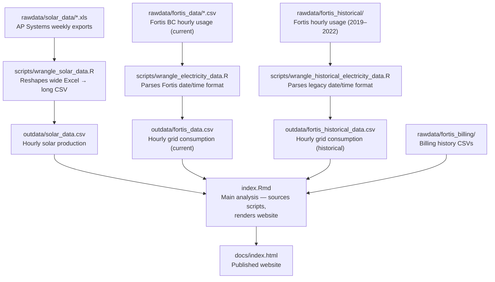

# Home Solar Energy Analysis

Personal data analysis project tracking solar energy production, household electricity
consumption, and billing for a residential 12.96 kW solar installation in Kelowna, BC.

[](https://pitherj.github.io/home_solar/)

**Author**: Jason Pither

---

## Background

When we installed solar panels in summer 2022, I could not find any websites sharing
*real* household data: hourly production curves, actual billing outcomes, or how grid
consumption changes after installation. This project fills that gap by publishing our
own data openly.

The 36-panel (12.96 kW) array was installed by [Okanagan Solar](https://www.oksolarhomes.com)
and feeds into Fortis BC's net metering program. A one-bedroom addition and, later, an
EV charger (June 2024) are also powered by the system, so the data capture multiple
stages of household electricity demand.

---

## Pipeline Workflow



Each wrangling script checks file modification times and skips processing when its
output CSV is already up-to-date.

---

## Required resources

### R packages

| Package | Purpose |
|---|---|
| `tidyverse` | Data wrangling and plotting |
| `here` | Portable file paths |
| `lubridate` | Date/time parsing |
| `readxl` | Reading AP Systems `.xls` files |
| `knitr` / `kableExtra` | Table rendering in the report |
| `rmdformats` | `robobook` HTML theme for `index.Rmd` |
| `weathercan` | Downloading Environment Canada weather data |
| `purrr` | Functional iteration in wrangling scripts |

### Raw data (manual placement required)

| Data source | Destination | How to obtain |
|---|---|---|
| AP Systems weekly energy reports | `rawdata/solar_data/` | Download `.xls` files from [apsystemsema.com](https://www.apsystemsema.com) |
| Fortis BC hourly usage | `rawdata/fortis_data/` | Download CSV from [fortisbc.com](https://www.fortisbc.com) customer portal |
| Fortis BC billing history | `rawdata/fortis_billing/` | Manually maintain `billing_history.csv` |
| Historical Fortis data (2019–2022) | `rawdata/fortis_historical/` | One-time export; already in repo |

---

## Project Structure

```
home_solar/
├── index.Rmd                  # Main analysis document; entry point for site build
├── _site.yml                  # RMarkdown website configuration (output → docs/)
├── home_solar.Rproj           # RStudio project file
│
├── scripts/
│   ├── wrangle_solar_data.R               # AP Systems Excel → solar_data.csv
│   ├── wrangle_electricity_data.R         # Fortis CSV → fortis_data.csv
│   ├── wrangle_historical_electricity_data.R  # Legacy Fortis → fortis_historical_data.csv
│   └── weather.R                          # Download Kelowna weather via weathercan
│
├── rawdata/
│   ├── solar_data/            # Weekly .xls files from AP Systems portal
│   ├── fortis_data/           # Hourly usage CSV(s) from Fortis BC portal
│   ├── fortis_billing/        # Billing history and meter/payment records
│   ├── fortis_historical/     # Historical hourly usage, Jan 2019 – May 2022
│   └── DATA-DICTIONARY.md     # Raw data field descriptions
│
├── outdata/
│   ├── solar_data.csv             # Processed hourly solar production
│   ├── fortis_data.csv            # Processed hourly grid consumption (current)
│   ├── fortis_historical_data.csv # Processed hourly grid consumption (historical)
│   └── weather_data.csv           # Hourly weather from UBCO/Okanagan station
│
├── docs/                      # Rendered website (auto-generated; deployed via GitHub Pages)
└── images/
    ├── overhead_panels.png    # Aerial view of solar array
    └── angle_panels.png       # Angled view of solar array
```

---

## Key Outputs

| File | Description |
|---|---|
| `docs/index.html` | Published analysis website |
| `outdata/solar_data.csv` | Hourly kWh production from all 36 panels, July 2022 – present |
| `outdata/fortis_data.csv` | Hourly kWh delivered/received, June 2022 – present |
| `outdata/fortis_historical_data.csv` | Hourly kWh delivered, Jan 2019 – May 2022 |
| `outdata/weather_data.csv` | Hourly weather from UBCO Okanagan station |

---

## Documentation

| File | Contents |
|---|---|
| `rawdata/DATA-DICTIONARY.md` | Field descriptions for all raw input files |

---

## License

[TODO: add license — e.g., CC BY 4.0 for data, MIT for code]

---

## Acknowledgments

Solar array supplied and installed by [Okanagan Solar](https://www.oksolarhomes.com),
Kelowna, BC. Electricity provided by [Fortis BC](https://www.fortisbc.com).
Solar monitoring by [AP Systems](https://www.apsystemsema.com).
