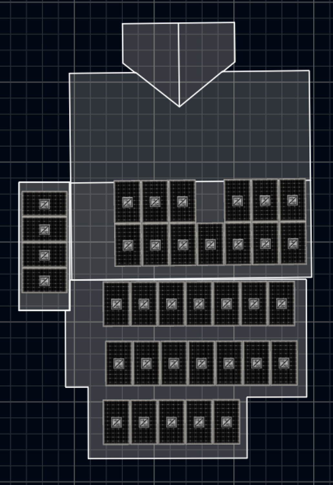
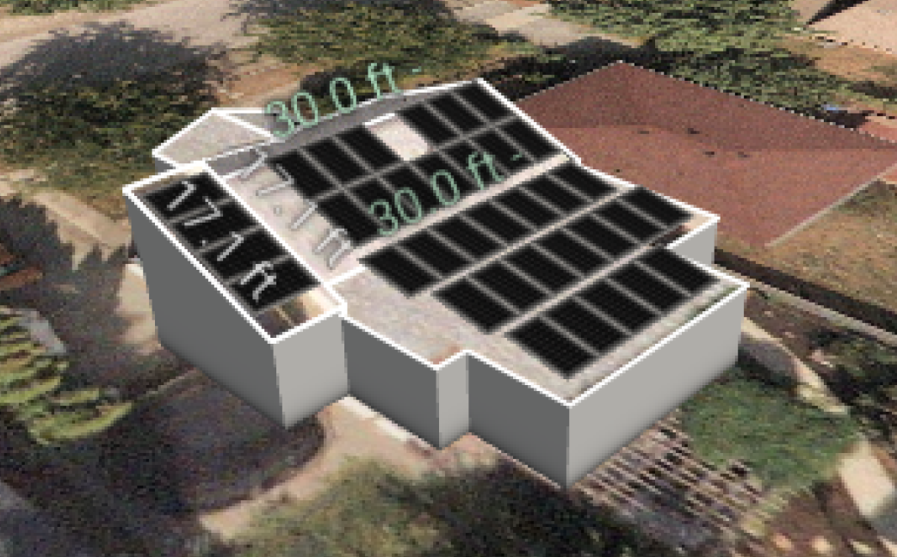

```{r setup, include=FALSE}
knitr::opts_chunk$set(echo = FALSE, warning = FALSE, cache = TRUE)
options(scipen = 999)
```

```{css, echo=FALSE}
pre, code {white-space:pre !important; overflow-x:auto}
```

```{r libraries, message = FALSE, echo = FALSE}
library(tidyverse)
library(here)
library(stringr)
library(tools)
library(hablar)
library(lubridate)
library(knitr)
library(timetk)
library(kableExtra)
```

**Disclaimer** 

All information provided in this website is based on personal experience and data available at the time of posting.  Any inaccuracies are solely the responsibility of the author, and readers use the information on this website at their own risk.

# Background

**NOTE** This is a work in progress...

When we were researching solar panels for our house, we found lots of websites describing the general economics of it, such as this helpful [site](https://ca.renogy.com/blog/what-is-the-average-solar-panels-roi-in-canada/), but surprisingly, I could not find any websites/blogs describing real data from a household that had installed solar.  What do the grid-energy consumption data look like before and after solar installation?  What are the actual hourly / daily patterns of solar energy production and grid energy consumption for a household? 

To fill this gap, I've decided to share our own data!  

>Caveat: we built an addition (short-term rental) at the same time as installing the solar array, therefore these two factors are entirely conflated for my data analyses.  In other words, until we get a current metre, I won't be able to directly compare our electricity consumption (or billing) data from before solar installation with after, because electricity used by the addition will be included.  

## Our household

We are two adults, two teenagers, and a dog occupying a 1.5 storey, 1260 ft$^{2}$ house in downtown Kelowna, British Columbia.  Yeah, it's a bit tight... 

The house was build in the 1940s, so it's as inefficient as you might expect. For instance, it still has wood chip insulation in most exterior walls. However, with the help of extremely handy members of the extended family, we've made some improvements that have definitely improved its efficiency.

We had new roof shingles and a ridge vent installed in December 2020 (leaking forced this), and I subsequently installed proper insulation and venting in the knee-walls next to the dormer bedrooms. That made a huge difference in the dormer rooms... much less hot in the summer, and much warmer in the winter.  

In Spring 2022, we added a one-bedroom dwelling (500 ft$^{2}$) to the west side of the house, and decided this was an opportune time to install solar panels. The addition is very efficient; it has two small heat-pump units, one in the living room and one in the bedroom.  It also has an electric fireplace for extra heat when needed (rarely).  

Like many folks, we hope to replace our current vehicle with an EV some time in the next four or five years, so having our own energy source would help when the time comes.  

We did not buy batteries for storing the solar power.  One day maybe...

In November 2022 we replaced the remaining old, large windows on the main floor of our house.  The house now feels much more air-tight!  That's the last of the home improvements for a while...

* * *

## Household energy consumption 

Our typical annual household energy consumption was about 9500 kWh. We'll show the data for this in a later [section](#hist_consumption).  For reference, this StatsCan [website](https://www150.statcan.gc.ca/t1/tbl1/en/tv.action?pid=2510006201&pickMembers%5B0%5D=1.1&pickMembers%5B1%5D=3.2&cubeTimeFrame.startYear=2017&cubeTimeFrame.endYear=2019&referencePeriods=20170101%2C20190101) has data about household energy consumption from across Canada.

We heat our house with an efficient gas furnace, so the laundry drier and electric stove/oven are probably the biggest consumers of electricity throughout the year. In the summer, air conditioning draws more. Of course we use A/C mostly when solar production should be greatest...  

* * *

## The solar array

In the summer of 2022 we had an array of thirty-six 360W panels (model: Longi LR4-60HPB-360M) installed on our south-facing roof. The entire array size is 12.96kW. 

Our solar system was supplied and installed by [Okanagan Solar](https://www.oksolarhomes.com).  Their team was amazing to work with.  

This system is large for our current needs (about 10,000 kWh / yr), but with the new one-bedroom addition, and hopefully an EV in the next few years, the 12.96kW solar system should be ideal.  

The layout of the array on our roof is shown in the following images (provided by Okanagan Solar as part of their assessment):  

{width=25%}  

{width=25%}  

Note that the flatter part of the roof extends over our patio.  

An added benefit of covering the south-facing roof with solar panels: the kids' dormer bedrooms are even cooler in the summer, because the panels are intercepting the energy before they hit the roof tiles. 

## Installation cost

The array with installation, including some angled mounting brackets for our flatter roof, cost just under `$25K`. This does not include the extra electrical upgrades we needed, which we were going to have to do anyways for the addition and for accommodating a future EV charger.  These upgrades included a new 200A panel, and a new meter with a new location on our lot.  These latter upgrades cost us about `$8K`, including electricity hookup etc...

OK Solar led us through the Energy Audit process, which ultimately got us the full `$5K` rebate from the federal green homes initiative, plus the `$600` for the audit activities themselves.  

So, for the solar array installation, the net cost was under `$20K` after rebates, but not including electrical upgrades.

* * *

## Electricity supplier

Fortis BC is our electricity provider, and like most places in North America, we don't have a choice about who we purchase electricity from.

As described at their [website](https://www.fortisbc.com/about-us/corporate-information/regulatory-affairs/our-electricity-utility/electric-bcuc-submissions/electricity-rates), Fortis bills customers bi-monthly, as of 2023, they charge at a fixed rate of **\$0.13266 per kWh**, which increased to **\$0.1416013** in 2024, and **\$0.1496** in January 2025.

Be sure to consult their website to keep track of any updates to rates.  

**Net metering** 

Fortis BC has a [net metering program](https://www.fortisbc.com/services/electricity-services/generating-your-own-electricity/net-metering), in which any energy produced by the solar array that is not used immediately on site is put back into the grid, and Fortis keeps track of this and "banks" the kWh on the account. In theory, Fortis then uses these banked amounts against future bills.   

Their [website explains what a net-metering bill looks like](https://www.fortisbc.com/services/electricity-services/generating-your-own-electricity/net-metering/understanding-your-net-metering-electricity-bill#item5).  

If we happen to have anything left in our "bank" at the end of each March, then our account will get credited at a rate equivalent to what Fortis pays their providers. This should be close to ~~\$0.10 / kWh~~ (actually, it's only \$0.05374 / kWh, based on the [Rate Schedule 3808 Tranche 1 Energy Price](https://www.bchydro.com/content/dam/BCHydro/customer-portal/documents/corporate/tariff-filings/electric-tariff/bchydro-electric-tariff.pdf) that BC Hydro charges Fortis). We don't know what the rate will be in 2025.

* * *

# Consumption and Production Data

We officially started producing solar power on July 8, 2022, and net metering started on July 15, 2022.  So, between July 8 and July 15, the grid benefited from our solar output! 

## Solar energy production data

I have another [script](https://github.com/pitherj/home_solar/blob/main/scripts/wrangle_solar_data.Rmd) that imports the raw solar energy data files, downloaded from the [AP Systems website](https://www.apsystemsema.com), and wrangles them into an appropriate format.

```{r echo = FALSE}
solar.data <- readr::read_csv("./outdata/solar_data.csv", show_col_types = FALSE)
```

Here's what the first few rows of the resulting data table looks like:

```{r}
solar.data
```

Let's visualize the data to check for errors:

```{r firstplot, echo = FALSE, fig.cap = "Figure 1: Hourly energy output (kWh) for the 36-panel solar array, starting July 8, 2022."}

solar.data %>%
  ggplot(aes(x = date, y = kWh)) +
  geom_line(colour = "darkgrey") +
  labs(x = "Date", y = "kWh") +
  #  scale_x_date(date_breaks="1 month", date_labels="%b") +
  theme_bw()
```

Ah, we see a strange data point... investigating, this is a morning when I took the datalogger offline. The system automatically sums up the total kWh produced over the time period that it was offline.

```{r echo = FALSE}
solar.data %>%
  filter(kWh > 30)
```

So for that day (August 30, 2022), we won't be able to use the hourly data for analysis.

But we can sum up the total kWh by day, and plot:

```{r secondplot, echo = FALSE, fig.cap = "Figure 2: Daily energy output (kWh) for the 36-panel solar array, starting July 8, 2022."}

solar.data %>%
  group_by(day) %>%
  summarise(total = sum(kWh, na.rm = TRUE)) %>%
  ggplot(aes(x = day, y = total)) +
  geom_line(colour = "darkgrey") +
  geom_point(shape = 1) +
    scale_x_date(date_breaks="4 month", date_labels="%b %y") +
  labs(x = "Date", y = "Daily solar energy production (kWh)") +
  ylim(0, 90)  +
  theme(axis.text.x = element_text(angle = 90, vjust = 0.5, hjust=1)) 
  #theme_bw()
```

And FYI, in 2022 Kelowna got an early start to winter... beginning of November saw more than 30cm of snow fall, and it STAYED!  Which meant that the solar panels were covered for the better part of 5 days.  I then cleared off a few of them (the steeper angled ones), and we saw a wee bit of sun.  However, from November through February each year, Kelowna tends to be very grey... the clouds settle in the valley and just stay here. But it's often sunny at higher elevation.  

* * *

## Grid energy consumption data

Another [script](https://github.com/pitherj/home_solar/blob/main/scripts/wrangle_electricity_data.Rmd) imports the raw Fortis energy consumption data for our account, downloaded from the FortisBC [website](www.fortisbc.com), and wrangles them into an appropriate format.  

Annoyingly, these data downloaded from the Fortis portal do not necessarily line up with what Fortis actually uses for billing calculations; this is because they rely on our meter to communicate with them, which doesn't always happen, in which case they estimate consumption for billing.

```{r echo = FALSE}
consumption.data <- readr::read_csv("./outdata/fortis_data.csv", show_col_types = FALSE)
```

I was able to get hourly data going back to January 1, 2019.

```{r echo = FALSE}
historical.data <- readr::read_csv(here::here("outdata", "fortis_historical_data.csv"), show_col_types = FALSE)
# bind
consumption.data <- dplyr::bind_rows(historical.data, consumption.data)
consumption.data <- consumption.data %>% rename(kw_solar_to_grid = kw_returned, kw_fortis_from_grid = kw_consumed)
```

Let's first look at last summer's data (2022), staring June 1st:

```{r}
consumption.data
```

Let's visualize the data to check for errors, first limiting the date to June 1 2022 and after:

```{r thirdplot, echo = FALSE, fig.cap = "Figure 3: Hourly energy consumption (kWh) for our house, starting June 1, 2022."}

consumption.data %>%
  filter(!is.na(kw_fortis_from_grid), day > "2022-06-1") %>%
  ggplot(aes(x = day, y = kw_fortis_from_grid)) +
  geom_line(colour = "darkgrey") +
    scale_x_date(date_breaks="4 month", date_labels="%b %y") +
  labs(x = "Date", y = "Hourly energy consumption from grid (kWh)")  +
  theme(axis.text.x = element_text(angle = 90, vjust = 0.5, hjust=1)) 
  #theme_bw()
```

hmm, that's messy...  

Let's sum up the total kWh consumed by day, and visualize:

```{r fourthplot, warning = FALSE, echo = FALSE, fig.cap = "Figure 4: Daily energy consumption (kWh) for our house, starting June 1, 2022."}

consumption.data %>%
  filter(day > "2022-06-1") %>%
  group_by(day) %>%
  summarise(total_consumed = sum(kw_fortis_from_grid)) %>%
  ggplot(aes(x = day, y = total_consumed)) +
  geom_line(colour = "darkgrey") +
  geom_point(shape = 1) +
  lims(y = c(0,90)) +
  scale_x_date(date_breaks="4 month", date_labels="%b %y") +
  labs(x = "Date", y = "Daily energy consumption from grid (kWh)")  +
  theme(axis.text.x = element_text(angle = 90, vjust = 0.5, hjust=1)) 
  #theme_bw()
```

Note that the low consumption in June 2022 is due to data gaps, which are a mystery to Fortis. 

The substantial increase in energy consumption in November 2022 was from the combination of early winter/snow/cloud in Kelowna, and 3 weeks with our wonderfully handy in-laws living with us to do renos at our house.  So, over the first 3 weeks of November 2022, we were using more electricity than usual, and we had little sun for solar energy production. 

And in June 2024 we purchased a 2019 Chevy Bolt, so started charging this EV at home regularly.

Let's combine the data into one plot.

```{r, echo = FALSE}
if(max(consumption.data$day) <= max(solar.data$day)) {
all_data <- left_join(consumption.data, solar.data, by = c("day", "hour")) } else {
  all_data <- left_join(solar.data, consumption.data,by = c("day", "hour"))
}
```

```{r fifthplot, echo = FALSE, fig.cap = "Figure 5: Daily energy consumption (red) and solar production (blue) for our house (kWh), starting June 1, 2022. The solar system came online July 8."}

all_data %>%
    filter(day > "2022-06-1") %>%
  group_by(day) %>%
  summarise(total_consumed = sum(kw_fortis_from_grid, na.rm = TRUE),
            total_produced = sum(kWh, na.rm = TRUE),
            total_returned = kWh - kw_fortis_from_grid) %>%
  ggplot() +
  geom_line(aes(x = day, y = total_consumed), colour = "firebrick") +
  geom_point(aes(x = day, y = total_consumed), shape = 1, colour = "firebrick") +
  geom_line(aes(x = day, y = total_produced), colour = "blue") +
  geom_point(aes(x = day, y = total_produced), colour = "blue", shape = 1) +
  scale_x_date(date_breaks="4 month", date_labels="%b %y") +
    lims(y = c(0,90)) +
  labs(x = "Date", y = "Energy (kWh)") +
  theme(axis.text.x = element_text(angle = 90, vjust = 0.5, hjust=1)) 
  #theme_bw()
```
Lots more consumption with the addition of our EV... but boy are we saving money and emissions on gas!

* * *

## Historical data

Let's have a look at historical data for comparison

```{r histplot, warning = FALSE, echo = FALSE, fig.cap = "Figure 6: Daily energy consumption (kWh) for our house, starting January 1, 2019. July 2022 is when solar production started."}

consumption.data %>%
  #filter(day > "2022-06-1") %>%
  group_by(day) %>%
  summarise(total_consumed = sum(kw_fortis_from_grid)) %>%
  ggplot(aes(x = day, y = total_consumed)) +
  geom_line(colour = "darkgrey") +
  geom_point(shape = 1) +
  lims(y = c(0,90)) +
  scale_x_date(date_breaks="4 month", date_labels="%b %y") +
  labs(x = "Date", y = "Daily energy consumption from grid (kWh)") +
  theme(axis.text.x = element_text(angle = 90, vjust = 0.5, hjust=1)) 
  #theme_bw()
```


* * *

## Average annual consumption {#hist_consumption}

We have historical consumption data dating back to January 1st 2019.  So let's calculate annual consumption for the years since then, using the calendar year as the timeframe:

```{r hist_annual_consumption, echo = FALSE}
annual_hist_cons <- consumption.data %>%
  mutate(year = lubridate::year(day)) %>%
  group_by(year) %>%
  summarise(tot_kWh_used = sum(kw_fortis_from_grid, na.rm = TRUE))
```

```{r}
kbl(annual_hist_cons, caption = "Historical annual (calendar year) electricity consumption.", 
    booktabs = TRUE, digits = c(0, 0)) %>% 
  kable_styling(latex_options = c("scale_down", "hold_position"), position = "center")
```

Averaging consumption for 2019 through 2021, `r round(mean(annual_hist_cons$tot_kWh_used[1:3]), 0)` kWh was our typical annual electricity consumption, which is a bit lower than average household consumption [across the country](https://www150.statcan.gc.ca/t1/tbl1/en/tv.action?pid=2510006201&pickMembers%5B0%5D=1.1&pickMembers%5B1%5D=3.2&cubeTimeFrame.startYear=2017&cubeTimeFrame.endYear=2019&referencePeriods=20170101%2C20190101).


* * *

## Calculate total production and consumption {#production}

Let's do some calculations on the hourly data.  Have a look a the data to start, taking a sample of records from July 28th, 2022:

```{r echo = FALSE}
all_data <- all_data %>% rename(kw_solar_gross_produced = kWh)
all_data %>%
  filter(day > ymd("2022-07-28") & day <= ymd("2022-07-29") & hour > 5 & hour < 22) %>% 
  select(!date)
```

Aside from the obvious ones (day, hour, date) we have the following fields: 

* `kw_solar_to_grid` is the kWh from our solar system that we fed to the grid (data from Fortis). 
* `kw_fortis_from_grid` is the kWh that fortis logged as energy provided to us from the grid (data from Fortis). 
* `kw_solar_gross_produced` is the gross kWh produced by our solar system (data from the system). 

Focusing on the 14th hour record (2pm), we see that we produced 8.75 kWh of solar energy, and of that, 5.52 went to the grid. However, we also used 0.007 kWh of energy from the grid.  This means that at some specific time in that hour we weren't producing enough solar energy to cover the needs of our house... perhaps a cloud diminished solar production for 10-15 minutes, and during that time we needed to pull power from the grid.  

> It's important to note that the data from the solar array and the data from Fortis may not actually be temporally aligned perfectly. For instance, for the hour between 10am and 11am on a given day, the data associated with the solar array may actually be temporally offset from the data associated with Fortis.  This will likely be a source of error / uncertainty.

Let's calculate the energy that we consumed directly from our solar, and we'll call this `kw_consumed_from_solar`.

This is calculated as the gross solar produced (`kw_solar_gross_produced`) minus the energy returned to the grid (`kw_solar_to_grid`).

We'll then calculate the total energy consumed (`tot_kw_consumed`), which equals `kw_consumed_from_solar` plus `kw_fortis_from_grid`.

```{r echo = FALSE}
all_data <- all_data %>%
  replace_na(list(kw_solar_gross_produced = 0)) %>%
  mutate(kw_consumed_from_solar = kw_solar_gross_produced - kw_solar_to_grid,
         tot_kw_consumed = kw_consumed_from_solar + kw_fortis_from_grid) 
```

```{r echo = FALSE}
all_data %>%
  filter(day > ymd("2022-07-28") & day <= ymd("2022-07-29") & hour > 5 & hour < 22)
```

Next we'll calculate some summary statistics...

* * *

## Summary data

From July 8th 2022 to `r max(all_data$day)` (last day of data), let's calculate how much: 

* total energy consumed from grid (`total_kw_fortis_from_grid`)
* total solar energy returned to grid (`total_kw_solar_to_grid`)
* gross solar energy we've produced (`total_kw_solar_gross_produced`)
* solar energy used directly in house (`total_kw_solar_used`)
* total energy consumed (sum of energy from Fortis and from solar) (`total_kw_consumed`)

```{r echo = FALSE}
begin.tot <- all_data %>%
  filter(day >= ymd("2022-07-08")) %>%
  summarise(total_kw_fortis_from_grid  = sum(kw_fortis_from_grid, na.rm = TRUE),
            total_kw_solar_to_grid = sum(kw_solar_to_grid, na.rm = TRUE),
            total_kw_solar_gross_produced = sum(kw_solar_gross_produced, na.rm = TRUE),
            total_kw_solar_used = sum(kw_consumed_from_solar, na.rm = TRUE),
            total_kw_consumed = sum(kw_fortis_from_grid, na.rm = TRUE) + sum(kw_consumed_from_solar, na.rm = TRUE))
```

```{r}
kbl(t(begin.tot), caption = "Summary of energy production and consumption from July 8 2022 onward.", 
    booktabs = TRUE, digits = c(2), col.names = "kWh") %>% 
  kable_styling(latex_options = c("scale_down", "hold_position"), position = "center")
```

Do the same for when we started net metering (July 15)

```{r tots, echo = FALSE}
begin.tot2 <- all_data %>%
  filter(day >= ymd("2022-07-15")) %>%
  summarise(total_kw_fortis_from_grid  = sum(kw_fortis_from_grid, na.rm = TRUE),
            total_kw_solar_to_grid = sum(kw_solar_to_grid, na.rm = TRUE),
            total_kw_solar_gross_produced = sum(kw_solar_gross_produced, na.rm = TRUE),
            total_kw_solar_used = sum(kw_consumed_from_solar, na.rm = TRUE),
            total_kw_consumed = sum(kw_fortis_from_grid, na.rm = TRUE) + sum(kw_consumed_from_solar, na.rm = TRUE))
```

```{r}
kbl(t(begin.tot2), caption = "Summary of energy production and consumption from July 15 2022 onward.", 
    booktabs = TRUE, digits = c(2), col.names = c("kWh")) %>% 
  kable_styling(latex_options = c("scale_down", "hold_position"), position = "left")
```


Now do for one full year of data, December 16 2022 through December 15, 2023 inclusive.

```{r tots2, echo = FALSE}
year.tot <- all_data %>%
  filter(day >= ymd("2022-12-16") & day <= ymd("2023-12-15")) %>%
  summarise(total_kw_fortis_from_grid  = sum(kw_fortis_from_grid, na.rm = TRUE),
            total_kw_solar_to_grid = sum(kw_solar_to_grid, na.rm = TRUE),
            total_kw_solar_gross_produced = sum(kw_solar_gross_produced, na.rm = TRUE),
            total_kw_solar_used = sum(kw_consumed_from_solar, na.rm = TRUE),
            total_kw_consumed = sum(kw_fortis_from_grid, na.rm = TRUE) + sum(kw_consumed_from_solar, na.rm = TRUE))
```

```{r}
kbl(t(year.tot), caption = "Summary of energy production and consumption from December 16 2022 through December 15, 2023.", 
    booktabs = TRUE, digits = c(2), col.names = "kWh") %>% 
  kable_styling(latex_options = c("scale_down", "hold_position"), position = "center")
```

So over our previous full year, we produced `r year.tot$total_kw_solar_gross_produced` kWh of energy, and consumed `r year.tot$total_kw_consumed` kWh.  We thus produced an excess of `r year.tot$total_kw_solar_gross_produced - year.tot$total_kw_consumed` kWh.  
## Electric Vehicle in 2024

In June 2024 we got a 2019 Chevy Bolt (battery replaced in 2021), and we installed a charger that was operational in July 2024. So, this represents a new draw of electricity.

In this figure we saw earlier, we can see this new electricity usage:

```{r fourthplot-2, warning = FALSE, echo = FALSE, fig.cap = "Figure 4: Daily energy consumption (kWh) for our house, starting June 1, 2022."}

consumption.data %>%
  filter(day > "2022-06-1") %>%
  group_by(day) %>%
  summarise(total_consumed = sum(kw_fortis_from_grid)) %>%
  ggplot(aes(x = day, y = total_consumed)) +
  geom_line(colour = "darkgrey") +
  geom_point(shape = 1) +
  lims(y = c(0,90)) +
  scale_x_date(date_breaks="4 month", date_labels="%b %y") +
  labs(x = "Date", y = "Daily energy consumption from grid (kWh)")  +
  theme(axis.text.x = element_text(angle = 90, vjust = 0.5, hjust=1)) 
  #theme_bw()
```

## 2024 usage

Evaluate usage for December 16, 2023 through December 15 2024:

```{r tots3, echo = FALSE}
year2023_24.tot <- all_data %>%
  filter(day >= ymd("2023-12-16") & day <= ymd("2024-12-15")) %>%
  summarise(total_kw_fortis_from_grid  = sum(kw_fortis_from_grid, na.rm = TRUE),
            total_kw_solar_to_grid = sum(kw_solar_to_grid, na.rm = TRUE),
            total_kw_solar_gross_produced = sum(kw_solar_gross_produced, na.rm = TRUE),
            total_kw_solar_used = sum(kw_consumed_from_solar, na.rm = TRUE),
            total_kw_consumed = sum(kw_fortis_from_grid, na.rm = TRUE) + sum(kw_consumed_from_solar, na.rm = TRUE))
```

```{r}
kbl(t(year2023_24.tot), caption = "Summary of energy production and consumption from December 16 2022 through December 15, 2023.", 
    booktabs = TRUE, digits = c(2), col.names = "kWh") %>% 
  kable_styling(latex_options = c("scale_down", "hold_position"), position = "center")
```

So over our last full calendar year, we produced `r year2023_24.tot$total_kw_solar_gross_produced` kWh of energy, and consumed `r year2023_24.tot$total_kw_consumed` kWh.  We thus produced an excess of `r year2023_24.tot$total_kw_solar_gross_produced - year2023_24.tot$total_kw_consumed` kWh.   


* * *

# Check bill and net metering numbers

A reminder of the amounts for the total period, July 15, 2022 through `r max(all_data$day)` (last day of data):

```{r, echo = FALSE}
final_summary <- all_data %>%
  filter(day >= ymd("2022-07-15") & day <= max(all_data$day)) %>%
  summarise(total_kw_fortis_from_grid  = sum(kw_fortis_from_grid, na.rm = TRUE),
            total_kw_solar_to_grid = sum(kw_solar_to_grid, na.rm = TRUE),
            total_kw_solar_gross_produced = sum(kw_solar_gross_produced, na.rm = TRUE),
            total_kw_solar_used = sum(kw_consumed_from_solar, na.rm = TRUE),
            total_kw_consumed = sum(kw_fortis_from_grid, na.rm = TRUE) + sum(kw_consumed_from_solar, na.rm = TRUE))
```


```{r}
kbl(t(final_summary), caption = paste("Summary of energy production and consumption from 2022-07-15 to", max(all_data$day)), 
    booktabs = TRUE, digits = c(2), col.names = "kWh") %>% 
  kable_styling(latex_options = c("scale_down", "hold_position"), position = "center")
```


```{r echo = FALSE}
latest.bill.bank.number <- 209
```

Our latest bill (from Jan 16 2025 to March 16, 2025) shows our net metering "bank" has a balance of `r latest.bill.bank.number` kWh.  

At 2023 fiscal-year-end (March 31, 2023) we had 1702kWh left in our bank, and we got a refund (at \$0.05374/kWh) of \$91.47.

* * *

# Consumption and savings through calendar year of 2023 

We need to calculate total consumption (Fortis-metered energy use, IN ADDITION to the energy we drew directly from our solar, which Fortis would not have recorded) for a year, and for simplicity, we'll start at January 1, 2023, when Fortis introduced the new rate of `$0.13266/kWh`.  

```{r, echo = FALSE}
consumed.2023 <- all_data %>%
  filter(day >= ymd("2023-01-01") & day <= "2023-12-31") %>%
  summarise(tot_kwh_consumed = sum(tot_kw_consumed, na.rm = TRUE))
```

In 2023 we consumed a total of `r consumed.2023` kWh of energy.

At the rate of `$0.13266/kWh`, that would have cost us `r round(consumed.2023 * 0.13266, 2)` dollars.

What did we actually pay?  A total of $188.93 (including 5% GST).  That's a savings of `r round(consumed.2023 * 0.13266 - 188.93, 2)` dollars.  

HOWEVER, it is likely that in 2024 we will not pay anything for electricity, because we have enough banked energy from 2023 to get us through to spring.  If that's true, and combined with the rate increase to `$0.1416013 / kWh` then we'll save `r round(consumed.2023 * 0.1416013, 2)` dollars in 2024, assuming the same amount of energy consumed as in 2023.  

But we have to account for the cost of financing the loan too...

Over a calendar year, the portion of our loan payments attributable to the solar is about `$1165.56`.  So, in 2023, we saved **`r round(consumed.2023 * 0.13266 - 188.93, 2) - 1165.56`** after all costs.  In 2024, we can anticipate those savings to increase to **`r round(consumed.2023 * 0.1416013, 2) - 1165.56`**.  

**UPDATE MAY 21 2024**

We received our last bill of the fiscal year (April 2023 - March 2024), and as anticipated, did not pay for any electricity over that period.  We had 1702 kWh left in our bank on March 31st 2024, and for this we were credited 1702 x \$0.05374 = \$91.47.  And for the period April 1st to May 16th, 2024, we have already banked 1736 kWh!

* * *

# Estimating the break-even point

TO BE COMPLETED

